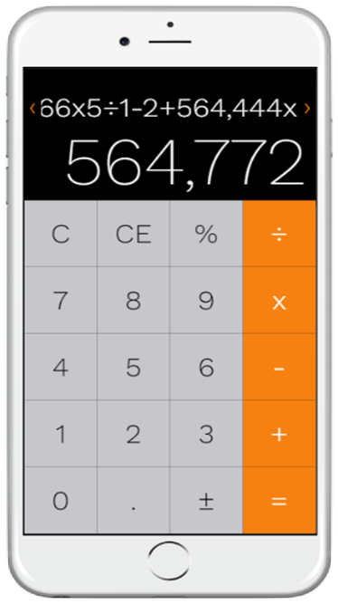

# IMPROVED CLONE IPHONE CALCULATOR
### This is a clone of the default iphone calculator with added features I personally feel I need from a mobile calculator. These added features include: 
* CE button.
* scrollable top display for all entries.
* arrow buttons for top display's navigation when content exceeds screen's width.
* strick operator that executed only once on every entry.

DEMO: http://clone-iphone-calculator.surge.sh

 

iphone prototype of the calculator

 

## Installation
1. clone Repo: `git clone https://github.com/sionelt/calculator-app.git`
2. change directory into the calculator-app directory: `cd ~/../calculator-app`
3. install dependencies: `npm install`
4. run project on Webpack dev server: `npm start`
5. bundle project into folder 'bulid' for deployment: `npm rn build`

## Contribution && Progress
Repo is free to clone, fork and contribute to. These are future features I hope to add and can contribute to:
* keyboard events for keypads.
* responsive to landscape orientation. 
* More operators buttons in landscape orientation mode.
* Turn project into a PWA (Progressive Web Application).

Check out documentation of the project for design structure, problem solving and lessons I learned from this project: <a href='/DOC.md'>documentation</a>

